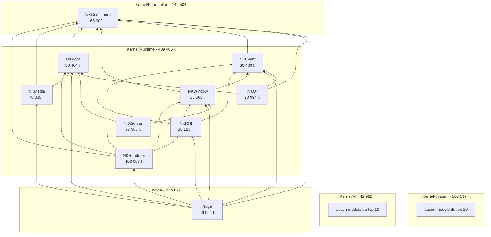

# Carte du dépôt Nkentseu

## Les cinq couches

Ce sont les cinq dossiers qui contiennent les bibliothèques. Ce sont aussi les cinq sections du registre de `config/modules.jenga` : Foundation (ligne 57), IA (63), System (91), Runtime (102), Engine (139).

| Couche | Bibliothèques | Lignes de code | Modules du top 10 |
|---|---:|---:|---|
| **Engine** | 3 | 47 916 | Noge |
| **Kernel/Runtime** | 20 | **489 486** | NKRenderer, NKMedia, NKFont, NKRHI, NKWindow, NKEvent, NKCanvas, NKUI |
| **Kernel/AI** | 15 | 42 982 | — |
| **Kernel/System** | 8 | 100 597 | — |
| **Kernel/Foundation** | 5 | 142 534 | NKContainers |

*Hors couches : `Integrations/`, 3 bibliothèques et 2 920 lignes.*

## Les dix modules les plus lourds, et leurs dépendances

*Une flèche `A --> B` veut dire « A déclare B dans son `.jenga` ». Dans VS Code, l'aperçu du graphe demande l'extension « Markdown Preview Mermaid Support ».*

### Les mêmes 26 flèches, en tableau

| Le module ↓ dépend de → | Containers | Event | Font | Window | RHI | Renderer | Media | Lignes | Déclaré dans |
|---|:-:|:-:|:-:|:-:|:-:|:-:|:-:|---:|---|
| **NKRenderer** | ● | ● | ● | ● | ● | | | 103 008 | `NKRenderer.jenga:43` |
| **NKMedia** | ● | | ● | | | | | 76 835 | `NKMedia.jenga:17` |
| **NKContainers** | | | | | | | | 65 609 | `NKContainers.jenga:22` |
| **NKFont** | ● | | | | | | | 50 404 | `NKFont.jenga:35` |
| **NKRHI** | ● | ● | | ● | | | | 36 191 | `NKRHI.jenga:51` |
| **NKWindow** | ● | ● | | | | | | 33 663 | `NKWindow.jenga:45` |
| **NKEvent** | ● | | | | | | | 30 403 | `NKEvent.jenga:27` |
| **Noge** | ● | ● | ● | ● | ● | ● | ● | 29 094 | `Noge.jenga:87` |
| **NKCanvas** | | | ● | ● | | | | 27 585 | `NKCanvas.jenga:64` |
| **NKUI** | ● | ● | ● | | | | | 23 994 | `NKUI.jenga:28` |
| **Flèches reçues** | **8** | **5** | **5** | **4** | **2** | **1** | **1** | | |

## Ce que la carte montre

- **Runtime écrase tout** : 8 des 10 modules les plus lourds et 489 486 lignes, soit plus que les quatre autres couches réunies (334 029 lignes).
- **NKContainers est la base commune** : 8 des 9 autres modules du top 10 le déclarent. Seul NKCanvas ne le déclare pas.
- **Noge est au sommet** : il déclare 7 des 9 autres modules, et aucun des neuf ne dépend de lui.
- **NKCanvas ne touche ni NKRHI ni NKRenderer**. Le registre explique pourquoi : ils sont « EXCLUSIFS » (`config/modules.jenga:141-144`).

## À savoir avant de s'en servir

- **Deux poids sont gonflés par des données embarquées.** NKFont, ce sont 86 % de polices intégrées au code : `NkFontEmbedded.cpp`, `DejaVuSansMono_data.h`, `Inter_data.h`, soit 43 347 lignes. NKRenderer, ce sont 40 % de tables de modèle de ciel : `ArHosekSkyModelData_*`, soit 41 494 lignes.
- **Les flèches sont celles écrites dans les `.jenga`**, pas le graphe réduit au minimum. Beaucoup de fichiers recopient des dépendances indirectes : NKRenderer déclare NKContainers alors qu'il l'obtient déjà par NKEvent.
- **Le registre de `config/modules.jenga` ne dit pas toujours la même chose** que le `.jenga` du module. Pour NKCanvas, la liste diffère (ligne 105). Cette carte suit les `.jenga`.
- **Le schéma d'`ARCHITECTURE.md` (§1) ne correspond pas au dépôt** : il décrit 7 niveaux, cite NKScene et NKScript, que `jenga info` ne connaît pas, et place NKWindow tout en bas. Je ne l'ai pas utilisé.
- **Mesure** : le code d'un module, c'est tout son dossier (`src/`, `pch/`, `tests/`), en `.h .hpp .inl .c .cpp .mm…`, lignes vides comprises. Le type « bibliothèque statique » vient de `jenga info`.