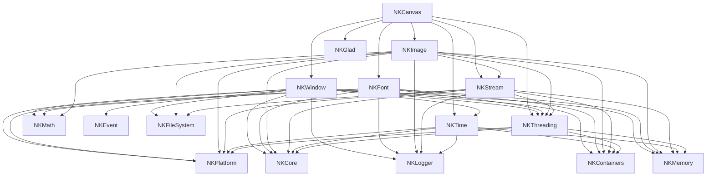

# NKCanvas — dépendances sur deux niveaux

> Source : `Kernel/Runtime/NKCanvas/NKCanvas.jenga` et les `.jenga` de ses dépendances. Vérifié avec `jenga build --target NKCanvas` le 2026-09-14 (Debug, 16/16 projets construits, 90 s).

## Réponse

**15 projets doivent être construits avant NKCanvas.** `Build Order (16 projects)` : NKCanvas est le 16ᵉ.

## Niveau 1 — dépendances directes (`NKCanvas.jenga:41`)

```python
_canvasDeps = ["NKWindow", "NKFont", "NKImage", "NKStream", "NKTime", "NKGlad", "NKThreading"]
```

**7 projets.** NKUI ne s'ajoute que si `NK_CANVAS_NKUI` est activé, ce qui n'est pas le cas par défaut (`config/graphics.jenga:90`).

## Niveau 2 — dépendances des dépendances

| Dépendance | Déclarées dans son `.jenga` |
|---|---|
| NKWindow (`NKWindow.jenga:46`) | NKPlatform, NKCore, NKLogger, NKMath, **NKTime**, NKContainers, NKMemory, **NKThreading**, NKEvent, NKFileSystem |
| NKFont (`NKFont.jenga:36`) | NKPlatform, NKCore, NKMemory, NKMath, NKContainers, **NKThreading**, NKLogger |
| NKImage (`NKImage.jenga:26`) | NKPlatform, NKCore, NKMemory, NKMath, NKContainers, NKLogger, **NKThreading**, NKFileSystem, **NKStream** |
| NKStream (`NKStream.jenga:22`) | NKCore, NKPlatform, NKLogger, NKMemory, NKContainers, **NKThreading**, NKFileSystem |
| NKTime (`NKTime.jenga:23`) | NKContainers, NKMemory, NKLogger, NKCore, NKPlatform |
| NKGlad (`NKGlad.jenga:11`) | *aucune* (`staticlib()` seul) |
| NKThreading (`NKThreading.jenga:28`) | NKCore, NKPlatform, NKMemory, NKContainers |

*En gras : des dépendances de niveau 1 qui réapparaissent au niveau 2.*

**8 projets nouveaux au niveau 2** : NKPlatform, NKCore, NKMemory, NKContainers, NKMath, NKLogger, NKEvent, NKFileSystem.

Au niveau 3, rien de nouveau : les dépendances de NKEvent, NKFileSystem et NKLogger sont toutes déjà dans la liste. **7 + 8 = 15.**

## Graphe (deux niveaux)



Vue simplifiée, par niveau :

```text
Niveau 0   NKCanvas
              │
Niveau 1   NKWindow  NKFont  NKImage  NKStream  NKTime  NKGlad  NKThreading
              │
Niveau 2   NKPlatform  NKCore  NKMemory  NKContainers  NKMath  NKLogger  NKEvent  NKFileSystem
           (+ NKTime, NKThreading, NKStream déjà vus au niveau 1)
```

## Ordre réel affiché par Jenga

```text
 1 NKPlatform    5 NKContainers   9 NKFont        13 NKEvent
 2 NKGlad        6 NKThreading   10 NKFileSystem  14 NKImage
 3 NKCore        7 NKMath        11 NKTime        15 NKWindow
 4 NKMemory      8 NKLogger      12 NKStream      16 NKCanvas
```

## À savoir

- **Le registre de `config/modules.jenga:105` donne une autre liste pour NKCanvas** : NKPlatform, NKCore, NKMemory, NKContainers, NKLogger, NKMath, NKEvent, NKWindow et NKFileSystem. Il n'y a ni NKFont, ni NKImage, ni NKStream, ni NKTime, ni NKGlad, ni NKThreading. La construction de NKCanvas suit la liste de son `.jenga`, mais les projets qui dépendent de NKCanvas suivent le registre.