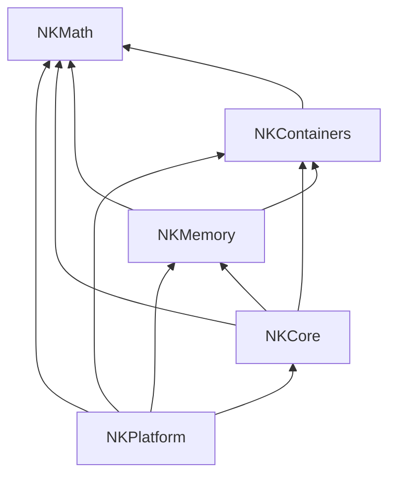

# Construction de NKMath seul — ordre de construction

> **Dépôt** : `C:\Users\ngatc\Desktop\gap l2\chap 1\Nkentseu` — 2026-09-14.
> **Outils** : Jenga 2.8.0 (installé par pip en mode éditable depuis `gap l2\Jenga-main`), Python 3.14.3.
> **Contexte affiché par Jenga** : configuration `Debug`, cible `Windows x86_64`, toolchain `clang-mingw`.
> **Où taper les commandes** : VS Code › *Terminal › Nouveau terminal* (PowerShell), à la racine du dépôt.

## 1. Réponse courte

Ordre de construction affiché par `jenga build --target NKMath` :

**1. NKPlatform → 2. NKCore → 3. NKMemory → 4. NKContainers → 5. NKMath**

- **5 projets sur 273**, 81 fichiers `.cpp` compilés, 5 bibliothèques `.lib` produites, `BUILD COMPLETED — SUCCESS`.
- Le **même ordre** est affiché aux deux exécutions (16:06 et 16:09).
- C'est le **seul ordre possible** : chaque projet dépend de celui qui est construit juste avant lui.

---

## 2. L'arbre de construction (ce qui vient en premier en bas, NKMath en haut)
# le resultat de la compilation :
```
Build Order (5 projects):
  1. NKPlatform [STATIC_LIB] → 
  2. NKCore [STATIC_LIB] (depends: NKPlatform) → 
  3. NKMemory [STATIC_LIB] (depends: NKCore, NKPlatform) → 
  4. NKContainers [STATIC_LIB] (depends: NKCore, NKMemory, NKPlatform) → 
  5. NKMath [STATIC_LIB] (depends: NKContainers, NKCore, NKMemory, NKPlatform)
```

### 2.1 Le même arbre avec toutes les dépendances déclarées

Chaque projet ne dépend pas seulement de celui du dessous : il déclare **toute la chaîne** en dessous de lui.

```text
  5.  NKMath         ──►  NKContainers · NKMemory · NKCore · NKPlatform
            ▲
  4.  NKContainers   ──►  NKMemory · NKCore · NKPlatform
            ▲
  3.  NKMemory       ──►  NKCore · NKPlatform
            ▲
  2.  NKCore         ──►  NKPlatform
            ▲
  1.  NKPlatform     ──►  (aucune dépendance)
```

Version graphique : GitHub l'affiche directement. Dans VS Code, l'aperçu Markdown a besoin de l'extension *Markdown Preview Mermaid Support*.



*(Une flèche `A --> B` signifie « A doit être construit avant B ».)*

---
